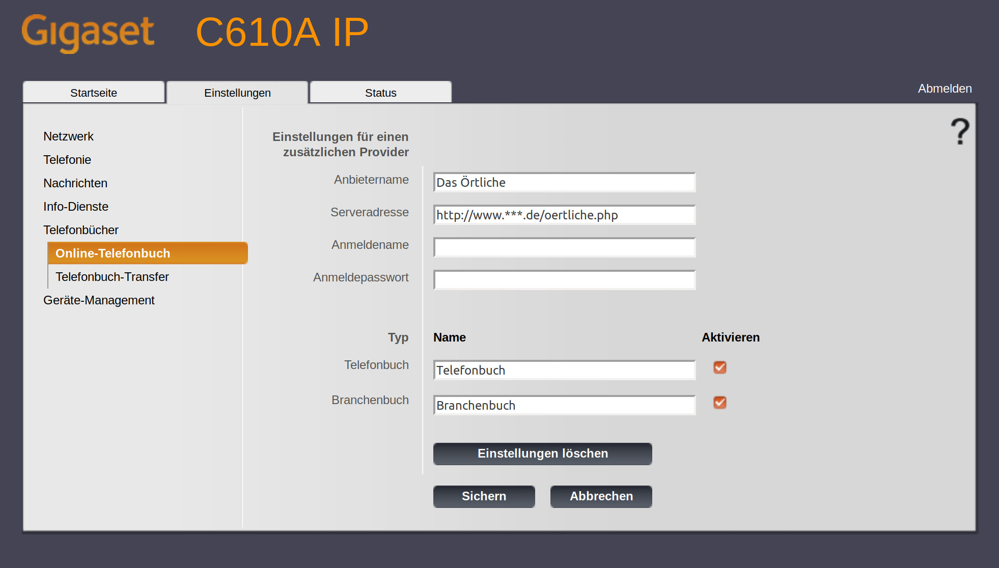
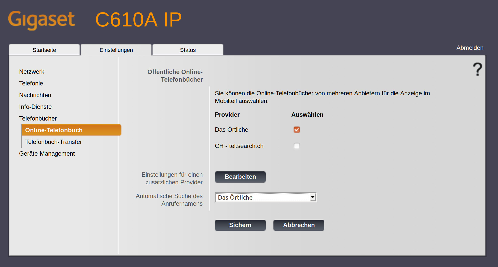

# OnlineTelefonbuch
Gigaset-Telefonbuch für Gigaset C610 IP und C610A IP.

Seit Klicktel im März 2018 ihre OpenAPI abgeschaltet hat, werden bei einem Gigaset die Anrufernamen nicht mehr angezeigt. Ich fand diese Funktion sehr hilfreich und hat für mich einen echten Mehrwert eines IP Telefons geliefert. Leider gibt es von Gigaset offiziell für Deutschland keinen mitgelieferten Provider, also habe ich mir ein kleines PHP Skript zum Behelf gestrickt.

Bei Fragen darf gerne ein Issue geschrieben werden.

# Installation
## Klassisch
Sie benötigen einen PHP Server. Auf diesem laden Sie das Skript `api.php` hoch. Die URL zu diesem Skript werden sie später als `Serveradresse` benötigen.

In der Datei `config.php` können Sie die Vorwahl konfigurieren.

## Heroku
Dieser Cloud-Dienst kann mit einem Free Dyno kostenlos genutzt werden. Die Software sollte sich hier auch automatisch updaten.

## Docker
### Sourcecode Build & Run (optional)
Sie können das Docker Image aus dem Sourcecode selbst bauen und starten mit diesem Befehl: `docker build --tag=gigaset-telefonbuch . && docker run gigaset-telefonbuch`

### Von Dockerhub (empfolen)
#### Download
Das Installieren dieses Scriptes mittels Docker ist ebenfalls möglich. Hierfür rufen Sie bitte `docker container run tigerxy/gigaset-telefonbuch` auf.

#### Starten
Im `Dockerfile` können Sie die Vorwahl konfigurieren. Alternativ können die Environment Variablen beim Start überschieben werden.
`docker container run -e ADD_AREA_CODE=1 tigerxy/gigaset-telefonbuch`

# Einrichtung
Ich habe diese Anleitung für die Firmware-Version 42.247 geschrieben.

Zu Beginn in der Weboberfläche der Telefonbasis anmelden. Zu der Seite `Einstellungen -> Telefonbücher -> Online-Telefonbuch` navigieren.

Auf dieser Seite bei `Einstellungen für einen zusätzlichen Provider` auf `Bearbeiten` klicken.

Nun `Anbietername` und `Serveradresse` ausfüllen und mit `Sichern` bestätigen

Nun `Häkchen` neben dem zuvor festgelegten Anbieternamen setzen und diesen bei `Automatische Suche des Anrufernamens` auswählen.

Fertig. Wenn alles geklappt hat, erscheint beim nächsten bekannten Anrufer, der Name, wie von früher gewohnt, im Display.

# Installation testen
Wenn man die die Seite `test.html` aufruft, kann dort die API getestet werden.

# Weitere Informationen
Ich habe diese [Dokumentation](https://teamwork.gigaset.com/gigawiki/display/GPPPO/Online+directory) von Gigaset gefunden, die mir bei der Implementierung geholfen hat.

